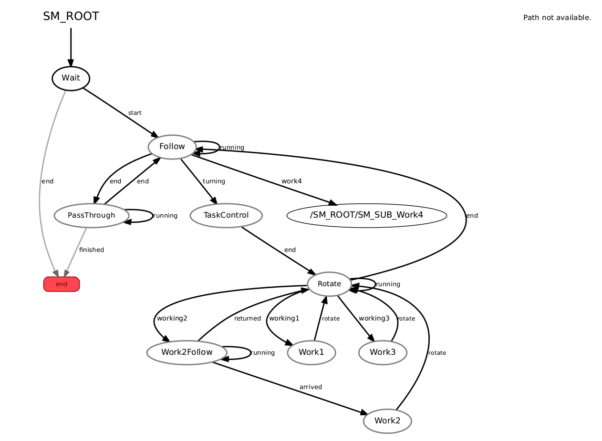

# CMPUT412 FALL 2019 - competition 3 report

## ***Overview***

This repo is the competition 3 implementations of group 3, and it is built upon
[https://github.com/TianqiCS/CMPUT412-C2]
[https://github.com/TianqiCS/CMPUT412-C1]

## ***Competiiton Objectives***

Using a Turtlebot to do multiple tasks consists of following track, detecting contours and docking with GMapping, AMCL. Scores are given based on the completeness of tasks, performance of each task and time usage of each run.

## ***Tasks***

In general, the robot needs to follow a track and do different specific taks at various locations. The track is white lines on the ground, full read lines and half red lines indicates the robot needs to stop, and half red lines also indicate the robot has specific tasks in the locations. Tasks for each location are detailed as following:

<p align = "center">
    
</p>

- ***Location 1*** is the first location maked by a short red line. Certain number (1~3) of objects are placed 90 degrees counterclockwise from the line. The robot needs to count the number of objects without leaving the track.
<p align = "center">

</p>

- ***Location 2*** is the second location, which located in the end of an additional track which branched off at a short red line. A white board with certain number(1~3) of shapes is placed at location 2, one of the shape is in green and others are in red. The robot needs to count the number of shapes and detect what shape the the green shape is.

<p align = "center">

</p>

- ***Location 4*** is the third location led by a off ramp track. 8 parking spots are located on the floor which are represented by red squares. The robot needs to dock at three specific spots. One spot has a AR tag places in the front, one spot has a red shape in the front, the shape is same as the green shape at location 2, the thrid spot is specified at the beginning of the competition. The robot need to park inside of the red square to get the full mark. After finishing parking at three spots, the robot needs to find the on ramp location and keep following the track.

<p align = "center">

</p>

- ***Location 3*** is the last location which is marked by three hald red lines, each red line indicated there is a shape located counterclockwise from the track, the robot needs to find the one with same shape as the green shape at location 2.

<p align = "center">

</p>

## _**Pre-requisites**_

-   The project is built with python2.7 on Ubuntu 16.04. Dependencies include ROS kinetic package, smach state machine, and other drivers for the turtle bot sensor. If these are not installed please refer to the official installation page on ROS wiki or official python installation websites.

    -   Kobuki  [http://wiki.ros.org/kobuki/Tutorials/Installation/kinetic](http://wiki.ros.org/kobuki/Tutorials/Installation/kinetic)

    -   Ros-Kinetic  [http://wiki.ros.org/kinetic/Installationu](http://wiki.ros.org/kinetic/Installationu)

    -   Python2  [https://www.python.org/downloads/](https://www.python.org/downloads/)

    -   Smach  [http://wiki.ros.org/smach](http://wiki.ros.org/smach)

Create or navigate the existing catkin workspace and clone our repository.


## _**Execution**_

-   Once you have the package in your workspace, change the package name to c3

    ```
    cd (your path)/catkin_ws
    catkin_make
    source devel/setup.bash

    ```
    now you can launch the program using

    ```
    roslaunch c3 c3_main.launch
    ```

-   arguments and parameters In the launch file c3.launch, the file will launch basic driver for the kuboki robot which is essential for the competition ( minimal.launch and 3dsensor.launch). Next, the file will bring up the basic node for this competition like main file and a usb camera. Finally, there are different sections for in the launch file like example.yaml to give the uvc camera  a basic understanding of view.

-  A map file of the lab is added to the file folder which is used for work4(the new location).   In the c3.launch file, the ar_track_alvar is used to regonize the AR tag. We comment out the view_nevigation package to increase the performance of the robot at runtime.

## ***Strategies***:

- Track followling:

    - We put additional usb camera at the lower front of the turtle_bot to follow the white line on the ground and the asus camera is used to detect shape of the target. The lower position of the camera improves precision with less exception tolerance as a trade-off.
    - In the function usb_callback, we use the usb camera to detect whether we have a long red line to  short red line. The method is that if it is a long red line there won't be any white in the middle of the track. We think its quicker and easier to identify the difference between two lines.
    - To ensure the target objects are included into the camera, the robot back up a little bit to fit the camera view into the right position.

- Shape detection:

    - Used cv2.pyrMeanShiftFiltering to blur image when detect contours' shapes, but this caused nonnegligible lag.
    - To ensure shape detect result is correct, we detect twice with a few seconds gap to check if results are the same.

- Docking with AMCL and GMapping:

    - After a fairly accurate map is established, we set the way points based on the map. By testing out each waypoint one by one, we want to make sure the run time error genreate by the odem has the minimum effect on the final parking spot.
    - Since the usb camera is stilling running during parking into these red squares, it is likely that the robot takes the parking red square as the functional red lines. New global varibies have set to avoid these conflicts.
searching strategy:
    - We used exhaustive search for the parking spot to make sure the robot complete the task and fit into all the squares.
    - Set initial pose when the robot is off ramp instead of the start point of the game to help localization and precision.
    - The docking process is based on waypoints. We test the waypoints one by one to ensure the the robot will dock on point.
    - The robot will skip the rest of waypoints if all task at location 4 have been completed.

- Project management:

    - The code file for work4 is seperate from the main code for further improvement on the coding style.
    - Heavliy used simple task functions like rotation and signal (led and sound) have been seperated from the original file to increase simplicity and reusability.
    - Based on the experience we collected from demo4 and demo5, we carefully develop the map using view_nevigation package.
    - To improve the runtime performance, we choose to not launch rviz, this can be enabled through commenting out lines in launch file.

## _**States**_
-    Our basic strategy includes using pid controller to follow lines, using opencv contour shape detection to detect shapes, using amcl to do localization, using move_base to reach goal point in the location 4.
-    Here are the process details:
-    Firstly, the robot will start with "Wait" state, once the user send unmarked dock point number and start signal, the robot will start follow the white line.
-    As the robot is running, it will find out whether there is a red long line(which means stop) or a red short line(which means detecting the image) and decide if it needs to switch states.
-    For different working tasks, the difference is based on the global variable of "current_work"
-    The state machine will have some kind of work flow like this:
        - 1. Following state will keep the robot following the white line
        - 2. If the robot hit a long red line it will enter the PassThrough state to perform a stop at the long red line
        - 3. If the robot hit a short red line it will enter the TaskControl state to determine how many 90 degrees it should trun and then it goes into Rotate state which controls the robot's rotation based on the yaw value.
        - 4. In the Rotate state, the robot will determine what kind of work it will do based on current value.
        - 5. For the task to count number of white tubes, the robot will detect how many red contours are in the front and indicate the number by Led lights and sound.
        - 6. For the task at location 2, the robot will detect how many red/green contours are in the front and indicate the total number by Led lights and sound, the robot will remember what shape the green contour is in location2.
        - 7. The robot goes 'off ramp' to dock at three locations, one has a the AR tag in the front, one has a contour with same shape in location 2 in the front, one has the index specified in the biginning of the game. The robot will parks in the center of the each square/location.
        - 9. After the robot finishs all parking task it will go to the 'on ramp' point and continue the 'lcoation 3' task, which is find the matching shape at location 2.
        - 10. The robot will go through all the shapes when selecting the shapes. If it found the right one it will make a turn on a light and make a sound.
        - 11. The run is ended when the robot is back to the starting line



## ***Sources***
- https://github.com/jackykc/comp5
- https://github.com/cmput412
- https://github.com/bofrim/CMPUT_412
- https://github.com/nwoeanhinnogaehr/412-W19-G5-public
- https://github.com/stwklu/CMPUT_412_code/
- https://www.pyimagesearch.com/2016/02/08/opencv-shape-detection/
- https://github.com/TianqiCS/CMPUT-412-C2
- https://github.com/HumphreyLu6/CMPUT412_demo5_p2
- https://www.cnblogs.com/kuangxionghui/p/8335853.html
- https://eclass.srv.ualberta.ca/pluginfile.php/5209083/mod_page/content/60/Competition%202_F19%20Line%20Following%20and%20object%20counting.pdf
- https://eclass.srv.ualberta.ca/pluginfile.php/5209083/mod_page/content/60/Comp3_F19GMapping%20and%20AMCL.pdf
